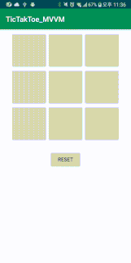

# TicTacToe

## Summary
A simple tic tac toe app, to illustrate the use of MVVM architectures to organize the application.

if you want to see MVC model. click below link

<https://github.com/Origogi/Android-TictacToe-Kotlin-MVC>
 
 - Android Application
 - Language : Kotlin
 
 
## Screenshot

